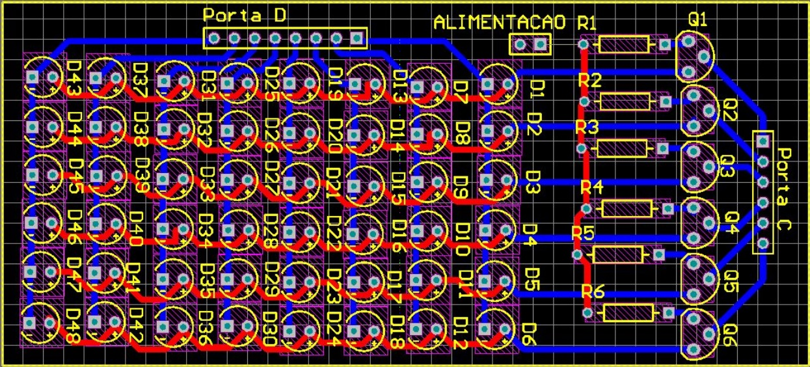

# Jogo Tetris 8x6 com matriz de LEDs

## Introdução
O projeto consistiu em desenvolver, utilizando da plataforma Arduino UNO (Atmega328P), um protótipo funcional do famoso jogo Tetris em uma matriz de leds 8x6. Foi necessário para tal a confecção de uma placa de circuito impresso e da elaboração do algoritmo lógico que será executado pelo microcontrolador.

		
## Componentes necessários
- 48 Leds vermelhos de alto brilho;
- Placa do Arduíno UNO;
- 6 transistores BC547;
- 5 Push buttons normalmente abertos;
- 6 resistores 1k5Ω, ¼W.

> Preço estimado do projeto: R$ 40,00

## Elaboração do Código
A parte lógica do projeto foi construída em algumas semanas. Primeiro realizou-se apenas com vistas a parte lógica e, após a placa para testes pronta, realizou-se o debug e os testes do código.

Foram utilizados os timers 0 e 1, para atualização do display e contagem do tempo (utilizado para atualizações do jogo diversas) respectivamente. Os PORTs C e D foram completamente ocupados pela matriz de LEDs. O PORT B alocou os cinco botões que acionam as interrupções que atuam na lógica do jogo.

## Montagem de Placa e Testes de Bancada
A montagem da Placa de Circuito Impresso consistiu em elaborar o esquemático e a PCI no software Altium e montá-la efetivamente no cobre, furando e soldando os componentes necessários.

